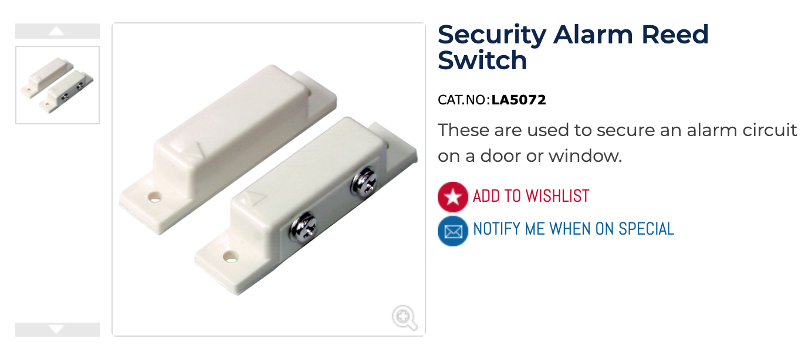
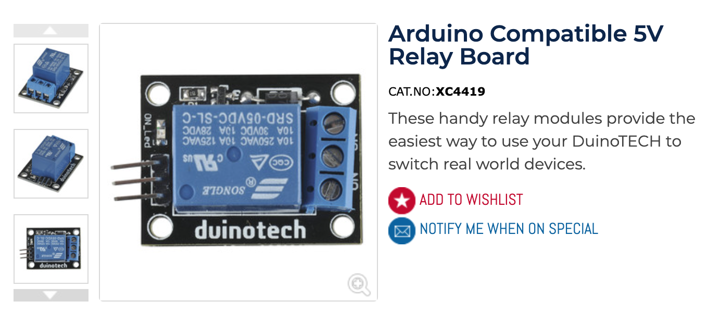

# Garage Door Raspberry Pi

This project was done on DietPi (bullseye) on a Raspberry Pi 1 Model B+ with Python 3 @shrocky2 code but with it publishing to a MQTT broker. The relay is controlled by the listener of a mqtt topic by @eclipse.org

Systemd is used for start-up (copy and change .py file for the relay)

## References

[shrocky2/GarageWeb (github.com)](https://github.com/shrocky2/GarageWeb)

[Eclipse Paho | The Eclipse Foundation](https://www.eclipse.org/paho/index.php?page=clients/python/docs/index.php)

## Hardware

Jaycar NZ: 

- [Security Alarm Reed Switch | Jaycar Electronics New Zealand](https://www.jaycar.co.nz/security-alarm-reed-switch/p/LA5072?pos=12&queryId=b229296d11a6e9c4ce93a8b3ba13294d&sort=relevance)
- [Arduino Compatible 5V Relay Board | Jaycar Electronics New Zealand](https://www.jaycar.co.nz/arduino-compatible-5v-relay-board/p/XC4419?pos=1&queryId=ad476d62bb4f9582e3bc2b650496178c)

|  |  |
| ------------------------------------------------------------ | ------------------------------------------------------------ |

Both are wired in a Normally CLOSED (NC)

@TODO

Wiring Diagram

## Code

### Prerequisites

DietPi need Python3 and GPIO

```bash
sudo apt-get -y install python3 python3-rpi.gpio python3-pip
```

After Python 3 is installed pano-mqtt is required from pip

```bash
sudo pip3 install paho-mqtt
```

### Sensors:

```python
import os
import RPi.GPIO as GPIO
import time

#Report to a MQTT broker
import paho.mqtt.publish as publish
Broker = '127.0.0.1'
pub_topic = 'garage/garage-door/status'

GPIO.setmode(GPIO.BOARD)
GPIO.setwarnings(False)

GPIO.setup(16, GPIO.IN, pull_up_down=GPIO.PUD_UP)
GPIO.setup(18, GPIO.IN, pull_up_down=GPIO.PUD_UP)
time.sleep(1)

while 1 >= 0:
    time.sleep(1)

    if GPIO.input(16) == GPIO.HIGH and GPIO.input(18) == GPIO.HIGH:  #Door Status is Moving
      publish.single(pub_topic,"moving",hostname=Broker, port=1883,)
      while GPIO.input(16) == GPIO.HIGH and GPIO.input(18) == GPIO.HIGH:
             time.sleep(.5)
      else:
        if GPIO.input(16) == GPIO.LOW:  #Door is Closed
          publish.single(pub_topic,"closed",hostname=Broker, port=1883,)
        if GPIO.input(18) == GPIO.LOW:  #Door is Open
          publish.single(pub_topic,"open",hostname=Broker, port=1883,)
```

### Relay

```python
import time
import RPi.GPIO as GPIO
GPIO.setmode(GPIO.BOARD)    # the pin numbers refer to the board connector not the chip
GPIO.setwarnings(False)
GPIO.setup(7, GPIO.OUT)     # sets the pin input/output setting to OUT
GPIO.output(7, GPIO.HIGH)   # sets the pin output to high

# MQTT
import paho.mqtt.client as mqtt

# The callback for when the client receives a CONNACK response from the server.
def on_connect(client, userdata, flags, rc):
    print("Connected with result code "+str(rc))
    client.subscribe("garage/garage-door/control")

# The callback for when a PUBLISH message is received from the server.
def on_message(client, userdata, msg):
    message_received=str(msg.payload.decode("utf-8"))
    if (message_received) == "activate":
        GPIO.output(7, GPIO.LOW)   # turns the relay switch ON
        time.sleep(.5)             # pauses system for 1/2 second
        GPIO.output(7, GPIO.HIGH)

client = mqtt.Client()
client.on_connect = on_connect
client.on_message = on_message

client.connect("127.0.0.1", 1883, 60)

client.loop_forever()

```

### Systemd

```bash
sudo nano /etc/systemd/system/garageDoor-sensor-mqtt.service
```

```bash
[Unit]
Description=MQTT Garage Door Sensor
After=network.target

[Service]
ExecStart=/usr/bin/python3 garageDoor-sensor-mqtt.py
WorkingDirectory=/home/dietpi
StandardOutput=inherit
StandardError=inherit
Restart=always
User=root

[Install]
WantedBy=multi-user.target
```

## Home Assistant

The relay is controlled in Home Assistant with the sensors connecting to the MQTT broker

### Prerequisites

- Integration: MQTT

- Home Assistant Community Store (HACS) with the frontend: button-card


### Adding MQTT Sensors

Edit the configuration.yaml

```
/config/configuration.yaml
```

```yaml
sensor:
  - platform: mqtt
    name: "Garage Door"
    state_topic: "garage/garage-door/status"
```

### Lovelace Card Code for the Garage Door Button

```yaml
type: custom:button-card
tap_action:
  action: call-service
  service: mqtt.publish
  service_data:
    topic: garage/garage-door/control
    payload: activate
entity: sensor.garage_door
icon: mdi:garage
show_state: true
styles: null
state:
  - icon: mdi:garage
    value: closed
  - icon: mdi:garage-open
    value: open
```


